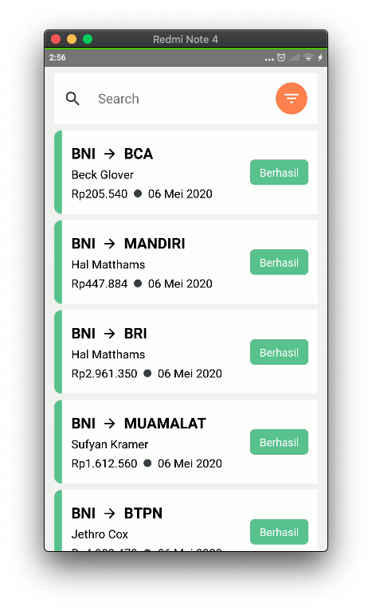
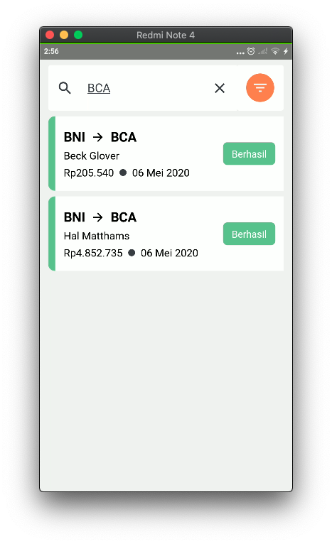

# Simple List of Transaction

#### Made by love with

- Typescript
- React native 0.62.2
- React-navigation 5 (Navigation)
- Redux (State Management)
- Rematch (Redux Library)
- React native paper (UI Library)
- Thwack (HTTP Client)

#### Features

- Transaction List
- Detail Transaction

#### Folder Strategty

Separation between UI and Business source so you dont worry about Spaghetti code

#### Screenshoots

    
    

    
    

